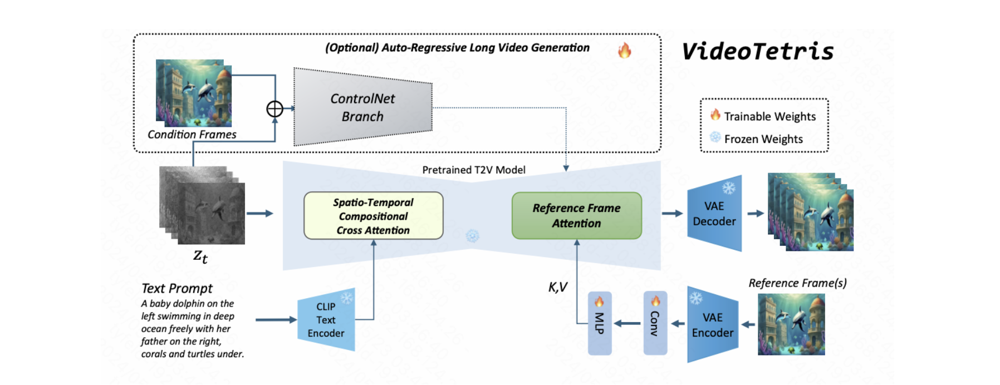

Ling Yang is currently a final-year Ph.D. student at Peking University, advised by [Bin Cui](https://cuibinpku.github.io/) and [Shuicheng Yan](https://scholar.google.com.hk/citations?user=DNuiPHwAAAAJ&hl=zh-CN). My research interests are Generative Modeling (Diffusion Models, LLMs) and AI for Science. I previously worked with [Yang Song](https://yang-song.net/), [Guohao Li](https://scholar.google.com/citations?user=J9K-D0sAAAAJ&hl=en), [Mengdi Wang](https://scholar.google.com/citations?user=33yNvIgAAAAJ&hl=en), [Ming-Hsuan Yang](https://scholar.google.com/citations?user=p9-ohHsAAAAJ&hl=zh-CN), [Bernard Ghanem](https://scholar.google.com/citations?user=rVsGTeEAAAAJ&hl=zh-CN), [Stefano Ermon](https://scholar.google.com/citations?user=ogXTOZ4AAAAJ&hl=en) and [Jure Leskovec](https://scholar.google.com/citations?user=Q_kKkIUAAAAJ&hl=zh-CN). I serve as a program committee member or reviewer for international conferences and journals including SIGGRAPH, TPAMI, ICML, ICLR, NeurIPS, CVPR, KDD, AAAI. 

I am in charge of a reasearch team and have led a series of works on Diffusion Models and LLMs including [RPG-DiffusionMaster](https://arxiv.org/abs/2401.11708), [VideoTetris](https://arxiv.org/abs/2406.04277) and [Buffer of Thoughts](https://arxiv.org/abs/2406.04271), and published [a book about Diffusion Models](https://item.m.jd.com/product/14075554.html). Feel free to email me for potential collaborations or discussions. Alternatively, my WeChat ID: jifengjianhao_yl.

 I am actively looking for postdoc positions (E-Mail: yangling0818@163.com).   
 

# Research Summary

### Generative Modeling
* Diffusion Model
  * Theory and Framework: [RPG](https://openreview.net/forum?id=DgLFkAPwuZ), [ContextDiff](https://openreview.net/forum?id=nFMS6wF2xq), [Consistency Flow Matching](https://arxiv.org/abs/2407.02398), [SADM](https://openaccess.thecvf.com/content/CVPR2024/html/Yang_Structure-Guided_Adversarial_Training_of_Diffusion_Models_CVPR_2024_paper.html)
  * Multimodal Content Generation (image/video/3D): [RPG](https://openreview.net/forum?id=DgLFkAPwuZ), [IterComp](https://arxiv.org/abs/2410.07171), [ConpreDiff](https://openreview.net/forum?id=wRhLd65bDt), [VideoTetris](https://arxiv.org/abs/2406.04277), [Trans4D](https://arxiv.org/abs/2410.07155), [IPDreamer](https://arxiv.org/abs/2310.05375)
  * AI for Science: [IPDiff](https://openreview.net/forum?id=qH9nrMNTIW), [IRDiff](https://openreview.net/forum?id=eejhD9FCP3), [BindDM](https://ojs.aaai.org/index.php/AAAI/article/view/29162)
* Large Language Model
  * Reasoning: [Buffer of Thought (BoT)](https://arxiv.org/abs/2406.04271)
  * Data-centric Application: [EditWorld](https://arxiv.org/abs/2405.14785)
### Representation Learning
* Graph-structured Data: [DPGN](https://openaccess.thecvf.com/content_CVPR_2020/html/Yang_DPGN_Distribution_Propagation_Graph_Network_for_Few-Shot_Learning_CVPR_2020_paper.html), [VQGraph](https://openreview.net/forum?id=h6Tz85BqRI), [OEPG](https://proceedings.mlr.press/v162/yang22d.html)
* Suquential Data: [BTSF](https://proceedings.mlr.press/v162/yang22e.html), [Cross Reconstruction Transformer](https://ieeexplore.ieee.org/document/10190201)

#  What's New 
* **Five papers** about Diffusion Models and LLMs (Buffer of Thought, **Spotlight**) are accepted by **NeurIPS 2024**.
* One paper about diffusion-based video frame interpolation is accepted by **ACM Multimedia 2024**.
* I propose [Consistency Flow Matching](https://arxiv.org/abs/2407.02398), converging **4.4x faster** than Consistency Model and **1.7x faster** than Rectified Flow while achieving better FID.
* I propose a new LLM reasoning framework, [Buffer of Thoughts](https://arxiv.org/abs/2406.04271)(https://github.com/YangLing0818/buffer-of-thought-llm).
* I release the project [VideoTetris](https://arxiv.org/abs/2406.04277) about compositional text-to-video generation.
* **Two papers** about Diffusion Models and AI for Science are accepted by **ICML 2024**.
* One paper about general/molecular graph diffusion is accepted by **TKDE 2024**.
* One paper about improved training algorithm of Diffusion Transformers (DiT), DDPMs and Score SDEs is accepted by **CVPR 2024**.
* Release our SOTA LLM-controlled diffusion model, [**RPG-DiffusionMaster**](https://openreview.net/forum?id=DgLFkAPwuZ).
* **Three papers** about Diffusion Models, GNN, AI for Science are accepted by **ICLR 2024**.
* Our paper about protein-aware 3D molecular diffusion models is accepted by **AAAI 2024**.
* Our [survey about Diffusion Models](https://arxiv.org/abs/2209.00796) is accepted by ACM Computing Surveys 2023, **collaborating with OpenAI**.
* One paper about text-to-image diffusion is accepted by **NeurIPS 2023**.
* I publish [a book about Diffusion Models](https://item.m.jd.com/product/14075554.html).
* One paper is accepted by **TNNLS 2023**.
* One paper is accepted by **TKDE 2023**.
* **Two papers** are accepted as **ICML 2022 Spotlight**.
* One paper is accepted by **CVPR 2020**.

# Selected Publications [[Full List](https://scholar.google.com.pk/citations?user=sIKujqAAAAAJ&hl=en)]

**[MLLM-Controlled Diffusion]** [Mastering Text-to-Image Diffusion: Recaptioning, Planning, and Generating with Multimodal LLMs](https://openreview.net/forum?id=DgLFkAPwuZ). ***Ling Yang**, Zhaochen Yu, Chenlin Meng, Minkai Xu, Stefano Ermon, Bin Cui. **ICML 2024**.*

**[RAG-based LLM Reasoning]** [Buffer of Thoughts: Thought-Augmented Reasoning with Large Language Models](https://arxiv.org/abs/2406.04271). ***Ling Yang**, Zhaochen Yu, Tianjun Zhang, Shiyi Cao, Minkai Xu, Wentao Zhang, Joseph E Gonzalez, Bin Cui. **NeurIPS 2024 spotlight**.*

<!-- **[Efficient Generative Modeling]** [Consistency Flow Matching: Defining Straight Flows with Velocity Consistency](https://arxiv.org/abs/2407.02398)

*Author List*: **Ling Yang**, Zixiang Zhang, Zhilong Zhang, Xingchao Liu, Minkai Xu, Wentao Zhang, Chenlin Meng, Stefano Ermon, Bin Cui -->

**[Complex Text-to-Video]** [VideoTetris: Towards Compositional Text-to-Video Generation](https://arxiv.org/abs/2406.04277). *Ye Tian\*, **Ling Yang**\*, Haotian Yang, Yuan Gao, Yufan Deng, Jingmin Chen, Xintao Wang, Zhaochen Yu, Xin Tao, Pengfei Wan, Di Zhang, Bin Cui. **NeurIPS 2024**.*

<!-- **[First Diffusion Survey with OpenAI]** [Diffusion Models: A Comprehensive Survey of Methods and Applications](https://arxiv.org/abs/2209.00796)

*Author List*: **Ling Yang**, Zhilong Zhang, Yang Song, Shenda Hong, Runsheng Xu, Yue Zhao, Yingxia Shao, Wentao Zhang, Bin Cui, Ming-Hsuan Yang

**[ICLR 2024]** [Protein-Ligand Interaction Prior for Binding-aware 3D Molecule Diffusion Models](https://openreview.net/forum?id=qH9nrMNTIW)

*Author List*: Zhilin Huang\*, **Ling Yang**\*, Xiangxin Zhou, Zhilong Zhang, Wentao Zhang, Xiawu Zheng, Jie Chen, Yu Wang, Bin Cui, Wenming Yang

**[ICML 2024]** [Interaction-based Retrieval-augmented Diffusion Models for Protein-specific 3D Molecule Generation](https://openreview.net/forum?id=eejhD9FCP3)

*Author List*: Zhilin Huang\*, **Ling Yang**\*, Xiangxin Zhou, Chujun Qin, Yijie Yu, Xiawu Zheng, Zikun Zhou, Wentao Zhang, Yu Wang, Wenming Yang -->

<!-- **[ICLR 2024]** [VQGraph: Rethinking Graph Representation Space for Bridging GNNs and MLPs](https://openreview.net/forum?id=h6Tz85BqRI)

*Author List*: **Ling Yang**, Ye Tian, Minkai Xu, Zhongyi Liu, Shenda Hong, Wei Qu, Wentao Zhang, Bin Cui, Muhan Zhang, Jure Leskovec -->

**[CVPR 2020]** [Dpgn: Distribution propagation graph network for few-shot learning](http://openaccess.thecvf.com/content_CVPR_2020/html/Yang_DPGN_Distribution_Propagation_Graph_Network_for_Few-Shot_Learning_CVPR_2020_paper.html). ***Ling Yang**, Liangliang Li, Zilun Zhang, Xinyu Zhou, Erjin Zhou, Yu Liu. **CVPR 2020**.* 

# Awards
* Selected for the distinguished student forum of [VALSE 2024](https://valser.org/2024/#/program) (**8 People in China**).
* National Scholarship for Ph.D student (**Top 1% in PKU**), 2022.
* Exceptional Award for Academic Innovation for Ph.D student (**Top 1% in PKU**), 2022.
* First-class Academic Scholarship, 2018, 2019, 2020.

 

 
