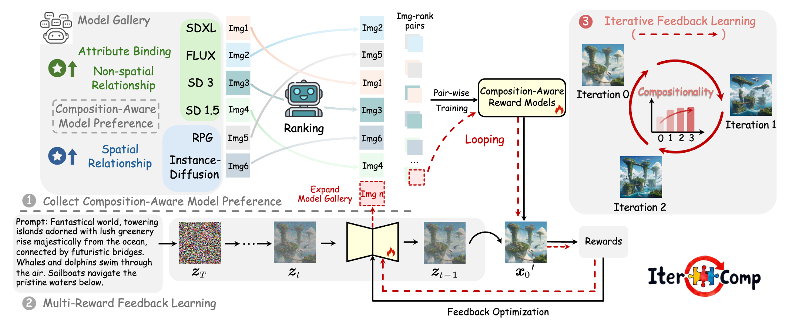

Ling Yang is currently a final-year Ph.D. student at Peking University, advised by [Bin Cui](https://cuibinpku.github.io/) and [Luxia Zhang](). I am also a Senior Research Assistant at Princeton University, fortunately working with Prof. [Mengdi Wang](https://mwang.princeton.edu/). My research interests are Generative AI (Diffusion Models, LLMs) and AI for Science. I previously worked with [Yang Song](https://yang-song.net/), [Guohao Li](https://scholar.google.com/citations?user=J9K-D0sAAAAJ&hl=en), [Shuicheng Yan](https://scholar.google.com.hk/citations?user=DNuiPHwAAAAJ&hl=zh-CN), [Ming-Hsuan Yang](https://scholar.google.com/citations?user=p9-ohHsAAAAJ&hl=zh-CN), [Bernard Ghanem](https://scholar.google.com/citations?user=rVsGTeEAAAAJ&hl=zh-CN), [Stefano Ermon](https://scholar.google.com/citations?user=ogXTOZ4AAAAJ&hl=en), and [Jure Leskovec](https://scholar.google.com/citations?user=Q_kKkIUAAAAJ&hl=zh-CN). I serve as a program committee member or reviewer for international conferences and journals including SIGGRAPH, TPAMI, ICML, ICLR, NeurIPS, CVPR, KDD, AAAI. Feel free to contact me for potential collaborations or discussions.   
[Email](mailto:yangling0818@163.com) | [WeChat](./image-1.png) | [Github](https://github.com/YangLing0818) | [Google Scholar](https://scholar.google.com.pk/citations?user=sIKujqAAAAAJ&hl=en) | [Twitter](https://x.com/LingYang_PKU) 

We have opening positions for PhDs, Masters and Research Interns (not limited to PKU and Princeton University, work online). Also, I am in charge of a reasearch team and have led a series of works on Diffusion Models and LLMs. Interested persons please contact me directly!

# Research Summary
My goal is to build powerful AI models capable of understanding, generating and reasoning with high-dimensional data across diverse modalities. I am currently focused on developing transferable techniques to improve generative models, including their training methodologies, architecture design, alignment, and inference efficiency. I am also interested in generative modeling as a tool for scientific discovery. I invented many foundational concepts and techniques in diffusion models and llms.

**Generative Model Foundations**  
  * Diffusion Theory and Framework: [RPG](https://openreview.net/forum?id=DgLFkAPwuZ), [IterComp](https://arxiv.org/abs/2410.07171), [ContextDiff](https://openreview.net/forum?id=nFMS6wF2xq), [Consistency Flow Matching](https://arxiv.org/abs/2407.02398), [Rectified Diffusion](https://arxiv.org/abs/2410.07303), [ConPreDiff](https://proceedings.neurips.cc/paper_files/paper/2023/hash/7664a7e946a84ac5e97649a967717cf2-Abstract-Conference.html), [SADM](https://openaccess.thecvf.com/content/CVPR2024/html/Yang_Structure-Guided_Adversarial_Training_of_Diffusion_Models_CVPR_2024_paper.html)
  * LLM Reasoning: [Buffer of Thought (BoT)](https://arxiv.org/pdf/2406.04271), [SuperCorrect](https://arxiv.org/abs/2410.09008)
  * Agent Framework: [Multi-Agent Collaborative Data Selection](https://arxiv.org/abs/2410.08102)
    
  
**Generative Applications**
  * Multimodal Generation: [VideoTetris](https://arxiv.org/abs/2406.04277), [EditWorld](https://arxiv.org/abs/2405.14785), [SemanticSDS](https://arxiv.org/abs/2410.09009), [Trans4D](https://arxiv.org/abs/2410.07155), [IPDreamer](https://arxiv.org/abs/2310.05375)  
  * AI for Science: [IPDiff](https://openreview.net/forum?id=qH9nrMNTIW), [IRDiff](https://openreview.net/forum?id=eejhD9FCP3), [BindDM](https://ojs.aaai.org/index.php/AAAI/article/view/29162)  

**Representation Learning** 
* Graph-structured Data: [DPGN](https://openaccess.thecvf.com/content_CVPR_2020/html/Yang_DPGN_Distribution_Propagation_Graph_Network_for_Few-Shot_Learning_CVPR_2020_paper.html), [VQGraph](https://openreview.net/forum?id=h6Tz85BqRI), [OEPG](https://proceedings.mlr.press/v162/yang22d.html)
* Suquential Data: [BTSF](https://proceedings.mlr.press/v162/yang22e.html), [Cross Reconstruction Transformer](https://ieeexplore.ieee.org/document/10190201)

#  What's New 
* I propose [SupperCorrect](https://github.com/YangLing0818/SuperCorrect-llm), achieving new SOTA performance among all 7B models.
* I propose [IterComp](https://arxiv.org/abs/2410.07171), leveraging iterative RLHF to achieve fast and realistic T2I generation.
* I propose [SemanticSDS](https://arxiv.org/abs/2410.09009) and [Trans4D](https://arxiv.org/abs/2410.07155) to enhance compositional generation in text-to-/3D/4D scenarios.
* **Five papers** about Diffusion Models and LLMs (Buffer of Thought, **Spotlight**) are accepted by **NeurIPS 2024**.
* One paper about diffusion-based video frame interpolation is accepted by **ACM Multimedia 2024**.
* I propose [Consistency Flow Matching](https://arxiv.org/abs/2407.02398), converging **4.4x faster** than Consistency Model and **1.7x faster** than Rectified Flow while achieving better FID.
* I propose a new RAG-based LLM reasoning framework, [Buffer of Thoughts](https://arxiv.org/pdf/2406.04271), outperforming [Tree of Thought](https://arxiv.org/abs/2305.10601).
* I release the project [VideoTetris](https://arxiv.org/abs/2406.04277) of first compositional text-to-video generation.
* **Two papers** about Diffusion Models and AI for Science are accepted by **ICML 2024**.
* One paper about general/molecular graph diffusion is accepted by **TKDE 2024**.
* One paper about improved training algorithm of Diffusion Transformers (DiT), DDPMs and Score SDEs is accepted by **CVPR 2024**.
* Release our SOTA LLM-controlled diffusion model, [**RPG-DiffusionMaster**](https://openreview.net/forum?id=DgLFkAPwuZ).
* **Three papers** about Diffusion Models, GNN, AI for Science are accepted by **ICLR 2024**.
* Our paper about protein-aware 3D molecular diffusion models is accepted by **AAAI 2024**.
* Our [survey about Diffusion Models](https://arxiv.org/abs/2209.00796) is accepted by ACM Computing Surveys 2023, **collaborating with OpenAI**.
* One paper about text-to-image diffusion is accepted by **NeurIPS 2023**.
* I publish [a book about Diffusion Models](https://item.m.jd.com/product/14075554.html).
* One paper is accepted by **TNNLS 2023**.
* One paper is accepted by **TKDE 2023**.
* **Two papers** are accepted as **ICML 2022 Spotlight**.
* One paper is accepted by **CVPR 2020**.

# Selected Papers [[Full List](https://scholar.google.com.pk/citations?user=sIKujqAAAAAJ&hl=en)]

* **Mastering Text-to-Image Diffusion: Recaptioning, Planning, and Generating with Multimodal LLMs**.  
**Ling Yang**, Zhaochen Yu, Chenlin Meng, Minkai Xu, Stefano Ermon, Bin Cui  
ICML 2024  [paper](https://openreview.net/forum?id=DgLFkAPwuZ) | [repo](https://github.com/YangLing0818/RPG-DiffusionMaster) | [tweet](https://x.com/_akhaliq/status/1749633221514461489)

* **Buffer of Thoughts: Thought-Augmented Reasoning with Large Language Models**  
**Ling Yang**, Zhaochen Yu, Tianjun Zhang, Shiyi Cao, Minkai Xu, Wentao Zhang, Joseph E Gonzalez, Bin Cui  
NeurIPS 2024 spotlight  [paper](https://arxiv.org/pdf/2406.04271) | [repo](https://github.com/YangLing0818/buffer-of-thought-llm) | [tweet](https://x.com/omarsar0/status/1799113545696567416)

<!-- **[Efficient Generative Modeling]** [Consistency Flow Matching: Defining Straight Flows with Velocity Consistency](https://arxiv.org/abs/2407.02398)

*Author List*: **Ling Yang**, Zixiang Zhang, Zhilong Zhang, Xingchao Liu, Minkai Xu, Wentao Zhang, Chenlin Meng, Stefano Ermon, Bin Cui -->

* **IterComp: Iterative Composition-Aware Feedback Learning from Model Gallery for Text-to-Image Generation**  
Xinchen Zhang\*, **Ling Yang**\*, Guohao Li, Yaqi Cai, Jiake Xie, Yong Tang, Yujiu Yang, Mengdi Wang, Bin Cui  
[paper](https://arxiv.org/abs/2410.07171) | [repo](https://github.com/YangLing0818/IterComp) | [tweet](https://x.com/_akhaliq/status/1844272544687509910)

* **Consistency Flow Matching: Defining Straight Flows with Velocity Consistency**  
  **Ling Yang**, Zixiang Zhang, Zhilong Zhang, Xingchao Liu, Minkai Xu, Wentao Zhang, Chenlin Meng, Stefano Ermon, Bin Cui  
  [paper](https://arxiv.org/abs/2407.02398) | [repo](https://github.com/YangLing0818/consistency_flow_matching) | [tweet](https://x.com/LingYang_PKU/status/1808509588414800224)

* **VideoTetris: Towards Compositional Text-to-Video Generation**  
Ye Tian\*, **Ling Yang**\*, Haotian Yang, Yuan Gao, Yufan Deng, Jingmin Chen, Xintao Wang, Zhaochen Yu, Xin Tao, Pengfei Wan, Di Zhang, Bin Cui  
NeurIPS 2024  [paper](https://arxiv.org/abs/2406.04277) | [repo](https://github.com/YangLing0818/VideoTetris) | [tweet](https://x.com/_akhaliq/status/1798897351534489608)

<!-- **[First Diffusion Survey with OpenAI]** [Diffusion Models: A Comprehensive Survey of Methods and Applications](https://arxiv.org/abs/2209.00796)

*Author List*: **Ling Yang**, Zhilong Zhang, Yang Song, Shenda Hong, Runsheng Xu, Yue Zhao, Yingxia Shao, Wentao Zhang, Bin Cui, Ming-Hsuan Yang

**[ICLR 2024]** [Protein-Ligand Interaction Prior for Binding-aware 3D Molecule Diffusion Models](https://openreview.net/forum?id=qH9nrMNTIW)

*Author List*: Zhilin Huang\*, **Ling Yang**\*, Xiangxin Zhou, Zhilong Zhang, Wentao Zhang, Xiawu Zheng, Jie Chen, Yu Wang, Bin Cui, Wenming Yang

**[ICML 2024]** [Interaction-based Retrieval-augmented Diffusion Models for Protein-specific 3D Molecule Generation](https://openreview.net/forum?id=eejhD9FCP3)

*Author List*: Zhilin Huang\*, **Ling Yang**\*, Xiangxin Zhou, Chujun Qin, Yijie Yu, Xiawu Zheng, Zikun Zhou, Wentao Zhang, Yu Wang, Wenming Yang -->

<!-- **[ICLR 2024]** [VQGraph: Rethinking Graph Representation Space for Bridging GNNs and MLPs](https://openreview.net/forum?id=h6Tz85BqRI)

*Author List*: **Ling Yang**, Ye Tian, Minkai Xu, Zhongyi Liu, Shenda Hong, Wei Qu, Wentao Zhang, Bin Cui, Muhan Zhang, Jure Leskovec -->

* **Dpgn: Distribution propagation graph network for few-shot learning**  
**Ling Yang**, Liangliang Li, Zilun Zhang, Xinyu Zhou, Erjin Zhou, Yu Liu  
CVPR 2020  [paper](http://openaccess.thecvf.com/content_CVPR_2020/html/Yang_DPGN_Distribution_Propagation_Graph_Network_for_Few-Shot_Learning_CVPR_2020_paper.html) | [repo](https://github.com/megvii-research/DPGN) 

# Awards
* Selected for AI Elite Forum of [WAIC](https://business.cctv.com/special/2024WAIC/index.shtml) (**20 people in the world**), 2024.
* Selected for the distinguished student forum of [VALSE](https://valser.org/2024/#/program) (**8 People in China**), 2024.
* Selected for [Annual Outstanding Author of Electronics Industry Press](https://www.phei.com.cn/), 2023.
* Selected for two consecutive years in the TechBeat Influencers List ([2023 list](https://mp.weixin.qq.com/s/k-HKTjijLP2uVrf7YEfXbA) and [2024 list](https://mp.weixin.qq.com/s/4KT0fAdx1hok0cEU5XcNIQ), **20 people in the world**).
* [Baidu Scholarship Nominee](http://scholarship.baidu.com/) (**20 people in the world**), 2023.
* National Scholarship for Ph.D student (**Top 1% in PKU**), 2022.
* Exceptional Award for Academic Innovation for Ph.D student (**Top 1% in PKU**), 2022.
* First-class Academic Scholarship, 2018, 2019, 2020.

